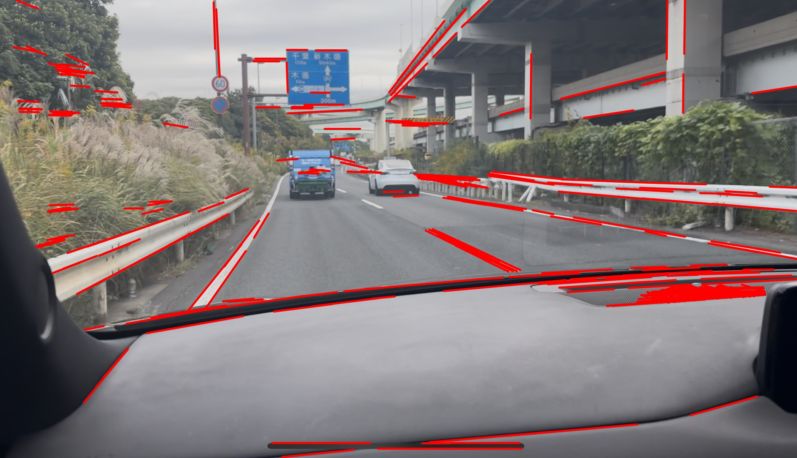

# 🚗 C++ Lane Detection (白線検知)

## 📌 何をするプロジェクトか
車載カメラの画像から、C++とOpenCV（Hough変換）を用いて道路の白線を高速に検知・抽出するプロジェクトです。

## 📷 デモ画像


## 🛠 使用技術
* C++20
* OpenCV 4.x
* CMake

## 🚀 ビルド方法
```bash
mkdir build
cd build
cmake ..
make
./LaneDetection

## 🔭 今後の開発予定
- [ ] ROI（関心領域）を道路面に絞り込み、誤検出を削減
- [ ] 動画・リアルタイム入力への対応
- [ ] 検出した車線から衝突リスクを判定するシミュレーション機能